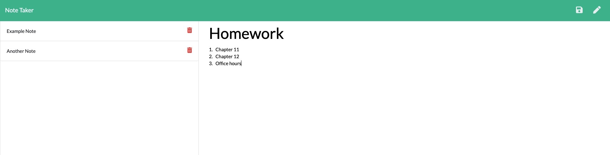

# 
**Note Taker**
   
  
  
## **DESCRIPTION**   
>  This application will use an Express.js back end and will save and retrieve note data from a JSON file.  
  
## **TABLE OF CONTENTS**  
* [DESCRIPTION](#DESCRIPTION)  
* [TABLE OF CONTENTS](#TABLE-OF-CONTENTS)  
* [APPLICATION LINKS](#APPLICATION-LINKS) 
* [INSTALLATION](#INSTALLATION)  
* [USAGE](#USAGE)  
* [LICENSE](#LICENSE)  
* [CONTRIBUTING](#CONTRIBUTING)  
* [TESTS](#TESTS)  
* [QUESTIONS](#QUESTIONS)  
  
## **APPLICATION LINKS**   
> [Live Application](http://desolate-ravine-23905.herokuapp.com/)  
> [GitHub Repository](https://github.com/jeremyrice98/note-taker)  
  
## **INSTALLATION**   
No installations needed.  
  
## **USAGE**  
This has been deployed with Heroku.   Navigate to the application and begin using the application.  
  
## **LICENSE**  
> This application is covered under the MIT license.
  
## **CONTRIBUTING**  
> 1. [Node.js](node.js) 
> 2. [Node Package Manager](npmjs.com)
 >    - [Inquirer](https://www.npmjs.com/package/inquirer)
 >    - [File System (fs)](https://nodejs.org/api/fs.html) 
 >    - [Path](https://www.npmjs.com/package/path)
 >    - [Express](https://www.npmjs.com/package/express)
 >    - [shortid](https://www.npmjs.com/package/shortid)
> 3. [Javascript](https://developer.mozilla.org/en-US/docs/Web/JavaScript)
> 4. [jQuery](https://jquery.com/)
> 5. [Insomnia](https://support.insomnia.rest/article/11-getting-started)
> 6. [JSON](https://www.json.org/json-en.html)
 
  
## **TESTS**  
> While developing, Insomnia was used to test routes.   

## **FUNCTIONALITY**

1. In a browser, navigate to the [application](http://desolate-ravine-23905.herokuapp.com/)

2. Click the "get started" button to begin utilizing the applicaiton. Note that your previous notes should appear on the left hand side of the page.

3. Add a new note by clicking on the pen icon in the upper right hand corner of the page.   You can also click on "Note Title" and begin typing.  This also applies to the body of the Note.  

4. Save the note by clicking the save icon in the upper right hand corner.   You can also delete a note by clicking the delete button next to the not on the left-hand side. 
  
## **QUESTIONS**  
Please contact me for any inquiries!  
| Reach Out | Repositories | Profile |  
| :------: | :------: |  :------: |  
| <ricefamily1003@gmail.com> | [GitHub](https://github.com/jeremyrice98/note-taker) |  [LinkedIn](https://www.linkedin.com/in/jeremy-rice-99055113/) |   
